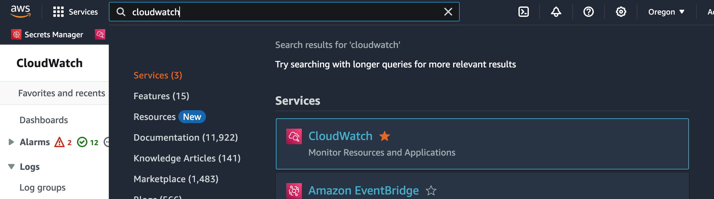
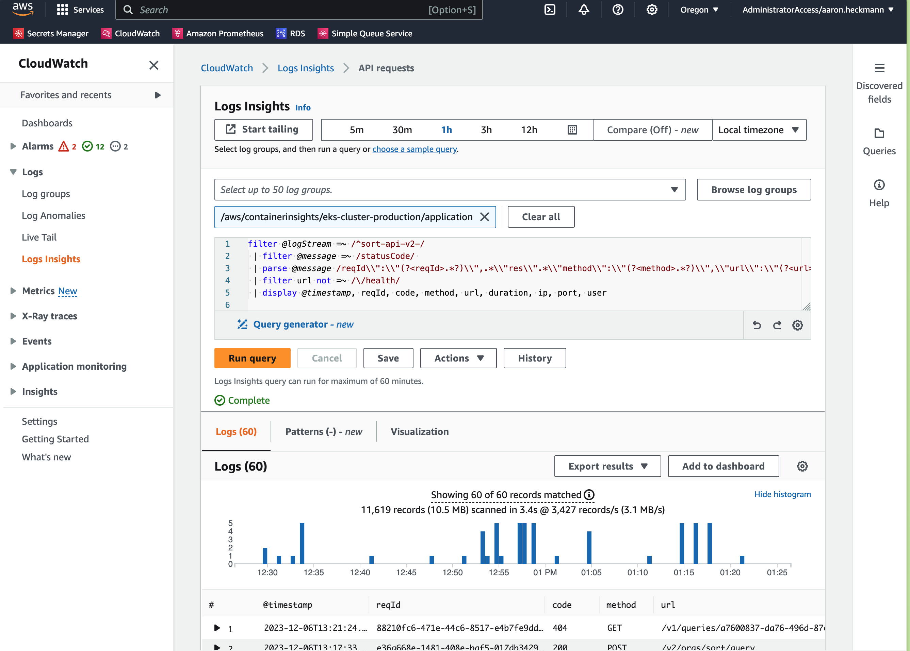
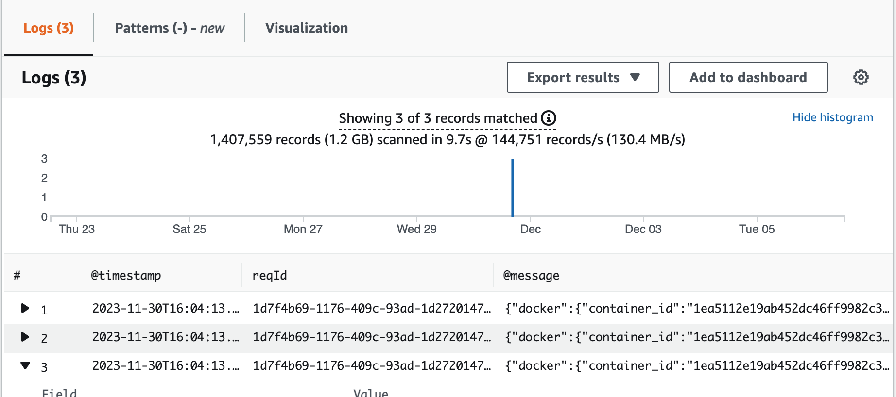

# Debugging the API

This document outlines how to debug this API in either the development or
production AWS environments. The steps for debugging both environments is the
same unless otherwise noted.

## Sentry

Typically you'll start debugging a production issue by investigating a bug
report on [Sentry][], a bug capture service. Here's an example:


Sometimes there is enough information in the bug report to determine what went
wrong but when you need more information about the request, you'll need to copy
the `reqId` value from the Sentry bug report and head over to [AWS Cloudwatch Logs Insights][].

## AWS Cloudwatch Logs Insights

To access [AWS Cloudwatch Logs Insights][] you'll need an AWS account. Once you
have an account, you'll log in to the Production environment (those steps are
outside the scope of this document) and then search for `CloudWatch`.



Click on the star next to the word "CloudWatch" to save it to your favorites bar
at the top of the screen. Then click on "CloudWatch" to open the CloudWatch
interface.



The Cloudwatch Logs Insights interface allows you to query application logs
using a custom AWS syntax. I won't cover details of the syntax right now, you
can always look that up later.

We want to search for all logs associated with the request which failed so we'll need the
`reqId` value we copied from the Sentry app earlier.

1. First, where it says "Select up to 50 log groups" choose `/aws/containerinsights/eks-cluster-production/application`.
1. Next, enter the following query, replacing `{{Request ID}}` with the value from Sentry.

```
filter @logStream =~ /^sort-api-v2-/
 | parse @message /\\"reqId\\":\\"(?<reqId>.*?)\\"/
 | filter reqId = '{{Request ID}}'
 | display @timestamp, reqId, @message
```

3. Then click `Run query`. _Note: You may need to adjust the timeframe of logs to query to locate your desired results._

When you find your logs you'll see something like the following at the bottom of the screen:



Click on the black arrow to the left of each log to see the detailed request logs including error details, request IP address, response status code, url, HTTP method, response duration and more.

## More information

For more example queries which you can copy / paste into Cloudwatch Insights, please take a look at our [document on Notion][Log Insights Examples].

[Sentry]: https://sortxyz.sentry.io/issues/?project=4504889143721984&query=&referrer=issue-stream&statsPeriod=7d&stream_index=3
[AWS Cloudwatch Logs Insights]: https://us-west-2.console.aws.amazon.com/cloudwatch/home?region=us-west-2#logsV2:logs-insights
[Log Insights Examples]: https://www.notion.so/sortxyz/CloudWatch-Insights-d92a1b8594544462b8dccc48249f2b74
