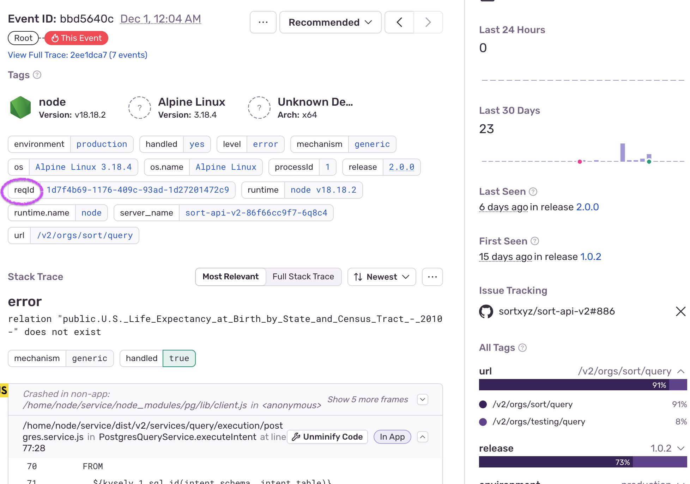

# Debugging the API

This document outlines how to debug this API in either the development or
production AWS environments. The steps for debugging both environments is the
same unless otherwise noted.

## Sentry

Typically you'll start debugging an issue by investigating a bug
report on [Sentry][], a bug capture service. Here's an example:

Sometimes there is enough information in the bug report to determine what went
wrong but when you need more information about the request, you'll need to copy
the `reqId` value from the Sentry bug report and head over to whatever logging
service you are using (AWS Cloudwatch Logs Insights for example), then perform
a search to find logs containing that value.

[Sentry]: https://sentry.io/
